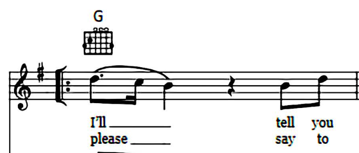

# beatles.ai-code
This repo contains the code that generated the music behind https://www.beatlesai.com/.

Note: This isn't code that can be run as repo, but instead shows the basic python code I used to train the two models, and the javascript code I used to convert the JSON representation of the music into [ABC](https://abcnotation.com/) format.

## What's in this repo?
`beatles-full-second-iter.ipynb` shows how I went about training the two neural nets (one for lyrics and the other for 'music').

`converter.js` converts the JSON music into ABC Notation

`data/i-feel-fine.abc` contains an example of a few lines of "I feel fine" in ABC notation
`data/yesterday-lyrics` contains the lyrics in the format I used to train the neural net
`data/yesterday-initial` contains the initial format of the music (stripped of key down to relative chords and melody) I manually typed out from sheet music.
`data/yesterday-json` contains a json version of the music (stripped of key down to relative chords and melody) so that the neural net would return the 

## Why?
In February of 2020 I completed the first fast.ai v1 course, and wanted to create a vision and an NLP project to apply what I learned. I wanted to do something creative, and while I found a lot of NN based projects regarding music, I couldn't find anything that dealt specifically with writing songs (ie chord progressions, melody, and lyrics), so being a Beatles fan, as well as the fact that they have a deep catalogue (which helps with lyric generation) and since most of their music is avaiable in sheet music notation (which I needed to create the custom musical encoding that I used to train the model), I chose to use their music.

## How does it work?
I created two fast.ai text learner models; one for lyrics and the other for the actual 'music'. The musical encoding is cleaned up by a few helper functions (I think if I had more data to work with, this wouldn't have been necessary).
The lyrics are then fed into the musical encoding, which is converted to JSON. That JSON is parsed, and is fed into another utility that converts the JSON encoding into an ABC string (which is a kind of musical notation mostly used by folk musicians). Converting to the notation into ABC was essential because ABCJS was the only library I could find that rendered music and played a midi file (with accompaniment) in the browser, which was crucial to make this project something that could be appreciated.

## Why use a custom encoding?
What I really wanted to do was create a model that was key agnostic, meaning that instead of learning music by specific notes or chords it learned their relative values. This would make it easier to train a model to make something that sounded more like real music becuase it isn't trying to combine multilpe keys into one. 


Here's the first line of the verse in `I Want To Hold Your Hand`, and here's the encoding. 

HOW TO READ THIS?
```json
["Imaj", "w", 7, 0.75], ["Imaj", "c", 5, 0.25], ["Imaj", "c", 4, 1], ["Imaj", "n", null, 1], ["Imaj", "w", 4, 0.5], ["Imaj", "w", 7, 0.5],
```
The arrays signify each new note that is sung. The first value is the chord relative to the key (which is not quite in nashville numbering because of issues with capitalization). 

The second item displays whether or not the new note is a word ("w"), a continutation of the word but with a different note sung ("c"), or a rest ("n"). 

The third value is the value of the note relative to the key; for example, a `7` indicates that the note is seven half tones above the base note (if the song is in the key of `C` the value of `7` would translate to `G`). The value is  `null` if the note is a rest.

The final value is the lenght of the note relative to a quarter note; `0.75` is a dotted eighth note, `0.5` is an eighth note etc.

## Creating the Data 
Transcribing a song to my data format intially took about 75 minutes per song, but by the end I could transcribe a song in about half of the time. The songs were mostly taken from the Beatles collection called #1

## Issues
Because creating the data took so much time, I wasn't able to train the model as well as I would like. Because of this, I had to really help it out - it wasn't picking up on breaking the song into specific sections (verse, chorus, etc) so I gave it a lot of help - in that sense, I did the heavy structural lifting while the because the learner couldn't determine separate portions very well with the limited data it had, which is huge bummer! 

### nashville numbering system
My inspiration is that as a musician, a lot of the gigs I've played involve the nashville numbering system. I won't go into all of it here, but the beauty of the nashville numbering system is that it doesn't matter what key the song is originally in, as long as you know the key, you can read the numerical chord numbers and deduce what chords you should play. For instance, the chords to the first line of "Don't Stop Believing'" are `E B C#m A` (the key being `E`), but if you want to easily play it in another key, you can transpose the chords to `I V vi IV`, and as long as you know the key the song is in, you can easily know waht chords to play. 

My thought was that stripping the music down to these basic roman numeral chords would help the model identify common chord structure; wheras if you trained it on songs that hadn't been broken down into the roman numerals would get something that sounded more like gibberish; ironically, my model still doesn't sound too much like real music, but it could've sounded much worse!

### Melody
That's all fine and well for chords, but how to handle the vocal lines? In a simliar way, I broke down the melody where the note the key was in into halftones (imitating the frets on a guitar). For instance, in the key of `G`, `G` is `0`, `D` is `7`, and `F` is 10.

### Converting to abcjs
`converter.js` takes the melody number, chord symbol and rythmic number and converts them into ABC notation in they key of G and adds them to a string.

### explain issues 
This isn't a perfect system - for example, in most cases chords only change once or twice a measure, but because of the importance of linking the note sung to a chord the model might learn to change chords more quickly. However, this wasn't too big of an issue.

## What I learned:
My main takeaway was that I needed way more data.

However, training the model on so few songs meant that I ran into a few issues. 
1. The main issue is that while the network learned the encoding and could create music, it had a harder time picking song structure, so most of the songs would just be a verse that was really long, with some occasionally creating a short bridge or chorus. I think with enough data this problem could be remedied. 

2. Additionally, my hope was to encode the lyrics within the music; it became apparent to me early on that including lyrics within the model only confused it, and 99% of the lyrics the unified netowork generated were 'love', 'you' and 'I'. As you can tell, the lyrics still don't make a lot of sense when a network is only trained on lyrics, so encoding the two together doesn't seem like a realistic goal right now given the technology, even if I had all of the beatles music encoded in that format.
